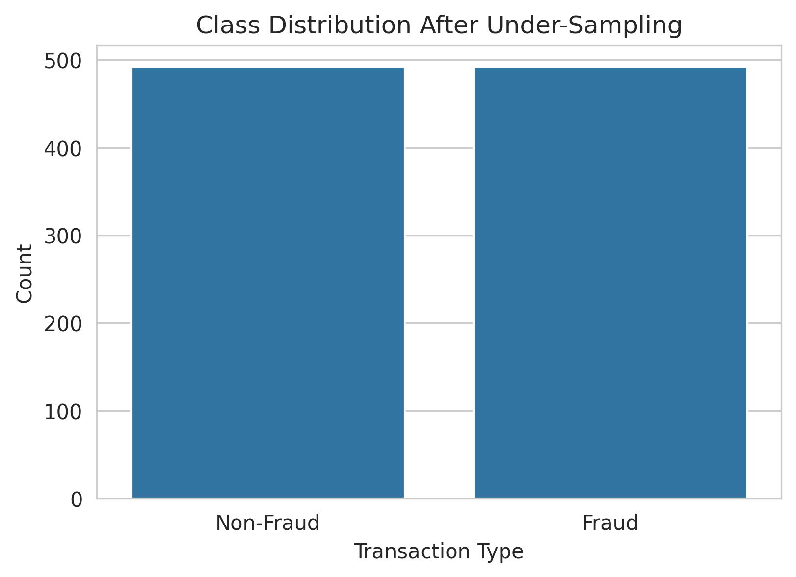
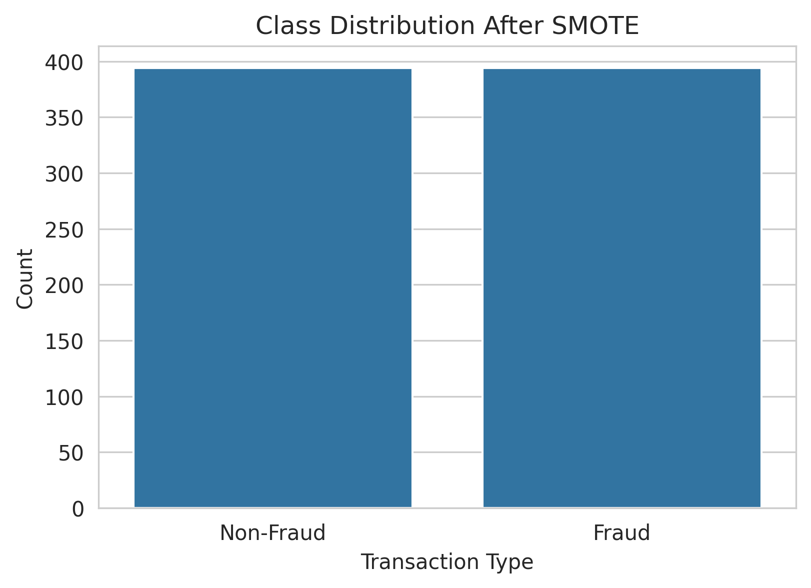
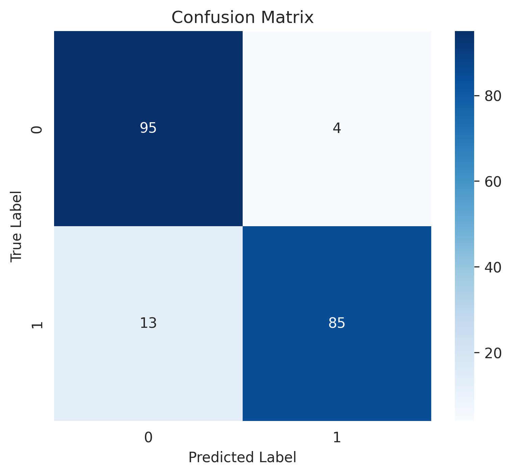
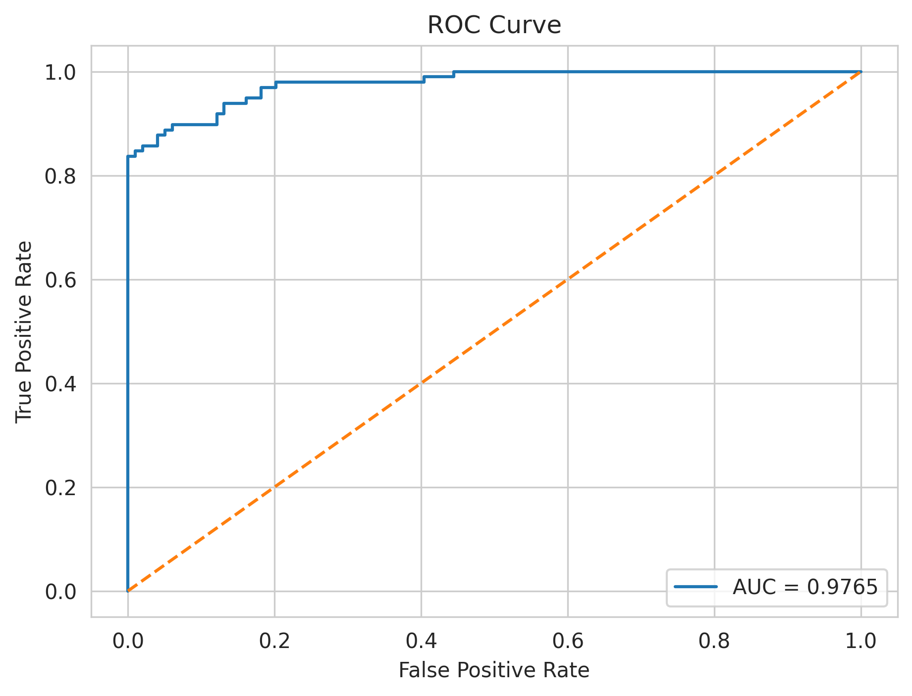
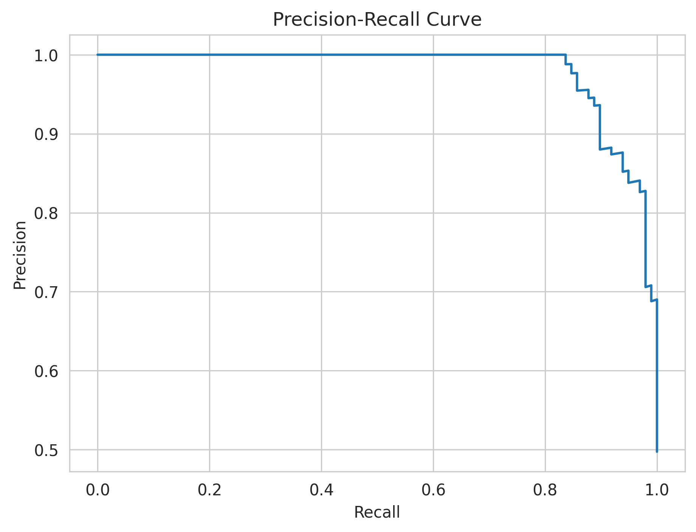
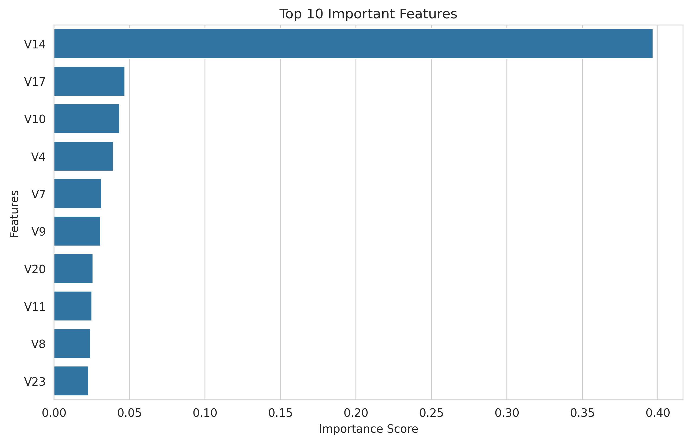

# Credit-Card-Fraud-Detection

[](https://colab.research.google.com/github/Kashish1418/Credit-Card-Fraud-Detection/blob/main/Credit_Card_Fraud_Detection.ipynb)

Machine Learning project focused on detecting fraudulent credit card transactions using SMOTE and XGBoost on highly imbalanced financial transaction data.

---

## Project Overview

Credit card fraud is a major challenge in the financial industry, causing billions of dollars in losses every year. The dataset used in this project is highly imbalanced, where fraudulent transactions account for only **0.17%** of all transactions.

The goal of this project is to build an efficient fraud detection system capable of identifying fraudulent transactions while minimizing false positives.

---

## Key Features

* Handled highly imbalanced transaction data using **SMOTE**
* Applied **feature scaling** using StandardScaler
* Compared multiple machine learning models
* Evaluated models using:

  * Accuracy
  * Precision
  * Recall
  * F1-Score
  * ROC AUC
* Built visualizations for model evaluation
* Saved trained model for deployment

---

## Models Used

| Model               | Purpose                     |
| ------------------- | --------------------------- |
| Logistic Regression | Baseline Model              |
| Random Forest       | Ensemble Learning           |
| XGBoost             | Final Best Performing Model |

---

## Tech Stack

* Python
* Pandas
* NumPy
* Scikit-learn
* XGBoost
* Imbalanced-learn
* Matplotlib
* Seaborn
* Pickle

---

## Dataset Information

* **Source:** Kaggle Credit Card Fraud Detection Dataset
* **Total Transactions:** 284,807
* **Fraud Cases:** 492
* **Fraud Percentage:** 0.17%

The features `V1–V28` are anonymized PCA-transformed features provided in the dataset.

Dataset Link:
https://www.kaggle.com/mlg-ulb/creditcardfraud

---

## Project Workflow

1. Data Collection
2. Data Analysis
3. Handling Imbalanced Data using SMOTE
4. Train-Test Split
5. Feature Scaling
6. Model Training
7. Model Evaluation
8. Visualization
9. Model Comparison
10. Model Saving

---

## Project Visualizations

### Class Distribution After Under-Sampling



### Class Distribution After SMOTE



### Confusion Matrix



### ROC Curve



### Precision Recall Curve



### Top 10 Feature Importance



---

## Results

| Model               | Accuracy | F1 Score |
| ------------------- | -------- | -------- |
| Logistic Regression | High     | Good     |
| Random Forest       | Better   | Better   |
| XGBoost             | Best     | Best     |

XGBoost achieved the best overall fraud detection performance based on precision, recall, and F1-score.

---

## Business Impact

A fraud detection system can help financial institutions identify suspicious transactions in real time, reduce financial losses, and improve customer security.

Optimizing the precision-recall tradeoff helps balance fraud detection capability with minimizing unnecessary customer alerts.

---

## How to Run the Project

### Option 1 — Google Colab

Open directly in Google Colab using the badge above.

---

### Option 2 — Run Locally

Clone the repository:

```bash
git clone https://github.com/Kashish1418/Credit-Card-Fraud-Detection.git
```

Install dependencies:

```bash
pip install -r requirements.txt
```

Run Jupyter Notebook:

```bash
jupyter notebook Credit_Card_Fraud_Detection.ipynb
```

---

## Project Structure

```text
Credit-Card-Fraud-Detection/
│
├── images/
│   ├── class_distribution
│     ├── after_under_sampling.png
│     ├── after_SMOTE.png
|   ├── confusion_matrix.png
│   ├── roc_curve.png
│   ├── precision_recall_curve.png
|   ├── importance_features.png
│
├── Credit_Card_Fraud_Detection.ipynb
├── fraud_detection_model.pkl
├── requirements.txt
├── README.md
```

---

## Future Improvements

* Deploy using Flask or FastAPI
* Build a Streamlit dashboard
* Add real-time fraud prediction
* Use SHAP for model explainability
* Experiment with LightGBM and CatBoost

---

## Author

**Kashish Gupta**
BSc Mathematics (Hons) with Research
University of Delhi

LinkedIn:
https://www.linkedin.com/in/kashish-gupta-245918295/

GitHub:
https://github.com/Kashish1418
